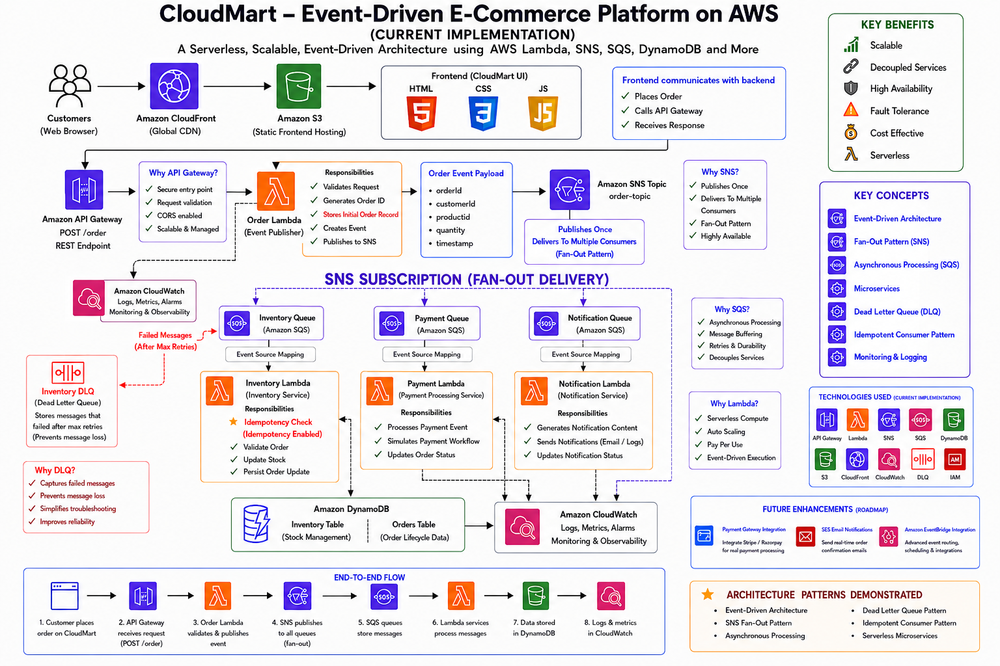
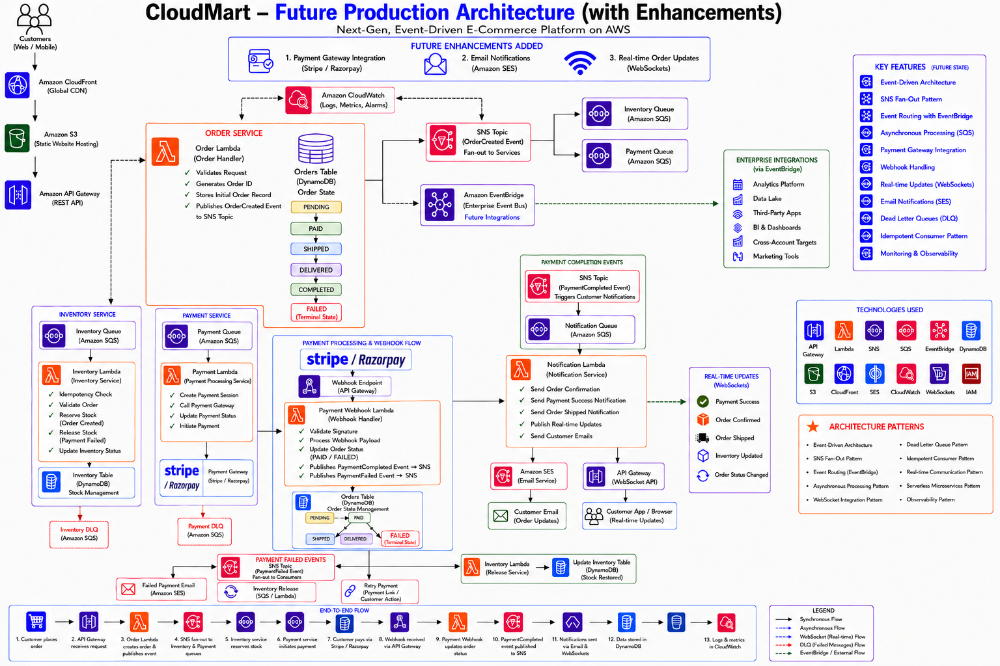

# ☁️ CloudMart – Event-Driven E-Commerce Platform

A production-inspired serverless e-commerce platform built using AWS Event-Driven Architecture.

CloudMart demonstrates how modern cloud-native applications process customer orders using loosely coupled microservices, asynchronous messaging, and serverless compute.

The project implements industry-standard cloud patterns such as:

* Event-Driven Architecture
* SNS Fan-Out Pattern
* SQS Decoupling
* AWS Lambda Microservices
* DynamoDB Persistence
* Dead Letter Queues (DLQ)
* Idempotent Consumers
* CloudWatch Monitoring

---

# 🌍 Real World Problem

Modern e-commerce platforms process thousands of customer orders every day.

A single customer order often triggers multiple business processes:

* Inventory Management
* Payment Processing
* Customer Notifications
* Order Tracking
* Analytics

In traditional monolithic systems, these services are tightly coupled.

As traffic increases, organizations commonly face:

❌ Service Dependencies

❌ Cascading Failures

❌ Limited Scalability

❌ Poor Fault Isolation

❌ Operational Complexity

❌ High Infrastructure Costs

❌ Reduced Reliability During Traffic Spikes

If one service fails, the entire workflow can be impacted.

As businesses scale, these limitations become significant operational challenges.

---

# 💡 Proposed Solution

CloudMart solves these challenges using an Event-Driven Serverless Architecture built entirely on AWS.

Instead of directly connecting services together, business events are distributed through managed messaging services.

Order processing becomes asynchronous, scalable, and fault tolerant.

### Workflow

1. Customer places an order
2. API Gateway receives the request
3. Order Handler Lambda validates the order
4. SNS publishes an order event
5. SNS distributes the event to multiple SQS queues
6. Inventory, Payment, and Notification services process the event independently
7. DynamoDB stores order and inventory data
8. CloudWatch provides centralized monitoring

This architecture enables independent scaling of services while maintaining loose coupling between components.

---

# 🏗️ Current Architecture



---

## Architecture Overview

The current implementation demonstrates a fully serverless event-driven order processing platform.

### Frontend Layer

#### Amazon CloudFront

Provides low-latency content delivery and global distribution.

#### Amazon S3

Hosts the static frontend application.

---

### API Layer

#### Amazon API Gateway

Acts as the secure entry point for customer requests.

Responsibilities:

* Receives order requests
* Invokes backend Lambda functions
* Provides REST API endpoints

---

### Order Processing Layer

#### Order Handler Lambda

The Order Handler acts as the entry point of the backend system.

Responsibilities:

* Validates incoming requests
* Generates Order ID
* Creates initial order record
* Publishes event to SNS Topic

---

### Event Distribution Layer

#### Amazon SNS

Implements the Fan-Out Pattern.

Benefits:

* One event
* Multiple consumers
* Loose coupling
* Independent service execution

When an order is created, SNS distributes the event to multiple downstream services.

---

### Message Queues Layer

#### Amazon SQS

Provides reliable asynchronous communication.

Queues:

* Inventory Queue
* Payment Queue
* Notification Queue

Benefits:

* Message durability
* Retry mechanisms
* Service isolation
* Fault tolerance

---

### Business Services Layer

#### Inventory Handler Lambda

Responsible for stock management.

Features:

* Inventory validation
* Stock deduction
* Inventory updates
* Idempotency checks

---

#### Payment Handler Lambda

Responsible for payment workflow simulation.

Features:

* Payment validation
* Order status updates
* Payment status management

---

#### Notification Handler Lambda

Responsible for customer communication.

Features:

* Notification generation
* Email simulation
* Event logging

---

### Data Layer

#### Amazon DynamoDB

Two DynamoDB tables are used.

##### Orders Table

Stores:

* Order ID
* Product
* Quantity
* Customer Information
* Order Status

##### Inventory Table

Stores:

* Product Details
* Stock Availability
* Inventory Updates

---

### Monitoring Layer

#### Amazon CloudWatch

Used for:

* Lambda Logs
* Error Tracking
* Monitoring
* Operational Visibility

---

### Reliability Layer

#### Dead Letter Queue (DLQ)

The Inventory Queue is configured with a DLQ.

Benefits:

* Failed messages are isolated
* No message loss
* Easier troubleshooting
* Improved system reliability

---

# 🚀 Future Production Architecture



---

## Future Architecture Enhancements

The current implementation focuses on core order processing workflows.

The platform is designed to evolve into a production-grade enterprise architecture.

---

### Payment Gateway Integration

Current State:

Payment processing is simulated.

Future Enhancement:

* Stripe
* Razorpay
* PayPal
* Amazon Pay

Benefits:

* Real payment verification
* Secure transactions
* Transaction auditing

---

### Amazon SES Integration

Current State:

Notifications are simulated using CloudWatch Logs.

Future Enhancement:

Amazon SES will provide:

* Order Confirmation Emails
* Shipping Updates
* Customer Communication
* Delivery Notifications

---

### Real-Time Order Tracking

Current State:

Backend processing only.

Future Enhancement:

* API Gateway WebSocket APIs
* Live Order Status Updates
* Real-Time Customer Tracking

---

### EventBridge Integration

Future events can be routed to:

* Analytics Systems
* Fraud Detection Engines
* Recommendation Services
* Business Intelligence Platforms

Without modifying existing services.

---

### Security Enhancements

Future architecture will include:

* AWS WAF
* Amazon Cognito
* AWS Secrets Manager
* AWS KMS

Benefits:

* Authentication
* Authorization
* Secret Management
* Encryption

---

### Data Lake & Analytics

Future integrations:

* Amazon S3 Data Lake
* AWS Glue
* Amazon Athena
* Amazon QuickSight

Business teams can gain valuable insights from order processing data.

---

# 🎯 Why This Architecture Matters

CloudMart is not just an order processing application.

It demonstrates how modern cloud-native systems are designed using:

* Event-Driven Architecture
* Serverless Computing
* Reliability Engineering
* Fault Tolerance
* Microservice Principles
* Scalability Patterns

The future architecture roadmap shows how the platform can evolve into a production-ready enterprise solution without requiring major redesign.

---

# ⚙️ AWS Services Used

| Service            | Purpose                |
| ------------------ | ---------------------- |
| Amazon S3          | Static Website Hosting |
| Amazon CloudFront  | Content Delivery       |
| Amazon API Gateway | API Management         |
| AWS Lambda         | Business Logic         |
| Amazon SNS         | Event Distribution     |
| Amazon SQS         | Message Queues         |
| Amazon DynamoDB    | Data Storage           |
| Amazon CloudWatch  | Monitoring             |
| Dead Letter Queue  | Reliability            |

---

# 🔄 End-to-End Workflow

1. Customer places an order
2. API Gateway receives request
3. Order Handler validates request
4. Order event published to SNS
5. SNS distributes event to multiple SQS queues
6. Inventory Service updates stock
7. Payment Service processes payment
8. Notification Service sends confirmation
9. DynamoDB stores business data
10. CloudWatch records operational logs

---

# Implementation Walkthrough:
[Click Here](./implementation-walthrough)

---


# 📂 Repository Structure

```text
cloudmart-event-driven-ecommerce-platform/
│
├── architecture/
├── documentation/
├── lambda-functions/
├── frontend/
├── screenshots/
├── demo/
└── README.md
```

---

# 📚 Project Documentation

Complete Project Documentation:

[📄 View Documentation](./documentation/CloudMart-Event-Driven-Ecommerce-Platform.pdf)

---

# 🎥 Demo Videos

### Console Walkthrough

https://drive.google.com/file/d/1wXQ_m7HRWb7NlWU42HiYe4tv7iYuODj0/view

### Working Demonstration

https://drive.google.com/file/d/1Nyyey6yIZxnf-XCFTbBEkwGVvA0slPkR/view

---

# 📁 Quick Navigation

### Architecture

[Architecture Folder](./architecture)

### Documentation

[Documentation Folder](./documentation)

### Lambda Functions

[Lambda Functions Folder](./lambda-functions)

### Frontend

[Frontend Folder](./frontend)

### Screenshots

[Screenshots Folder](./screenshots)

### Demo Videos

[Demo Folder](./demo)

---

# 👨‍💻 Author

**Adhithyan Sivaraman T**

B.Tech Computer Science & Engineering

Aspiring Cloud Engineer | AWS Enthusiast | DevOps Learner

GitHub:
https://github.com/Adhithyan-10

LinkedIn:
https://www.linkedin.com/in/adhithyan-sivaraman-t-399b5b362

---

⭐ If you found this project useful, consider giving it a star.
