# 🚀 CloudMart Implementation Walkthrough

This document provides a complete implementation walkthrough of the CloudMart Event-Driven E-Commerce Platform.

The screenshots below demonstrate the successful implementation, testing, and validation of every AWS component used in the architecture.

---

# 📋 Walkthrough Flow

```text
Frontend
    ↓
API Gateway
    ↓
Order Lambda
    ↓
SNS Topic
    ↓
SQS Queues
    ↓
Inventory Lambda
Payment Lambda
Notification Lambda
    ↓
DynamoDB
    ↓
CloudWatch Logs
```

---

# Step 1 — Order Handler Lambda Validation

The Order Handler Lambda is responsible for receiving incoming order requests and publishing order events to Amazon SNS.

### Screenshot

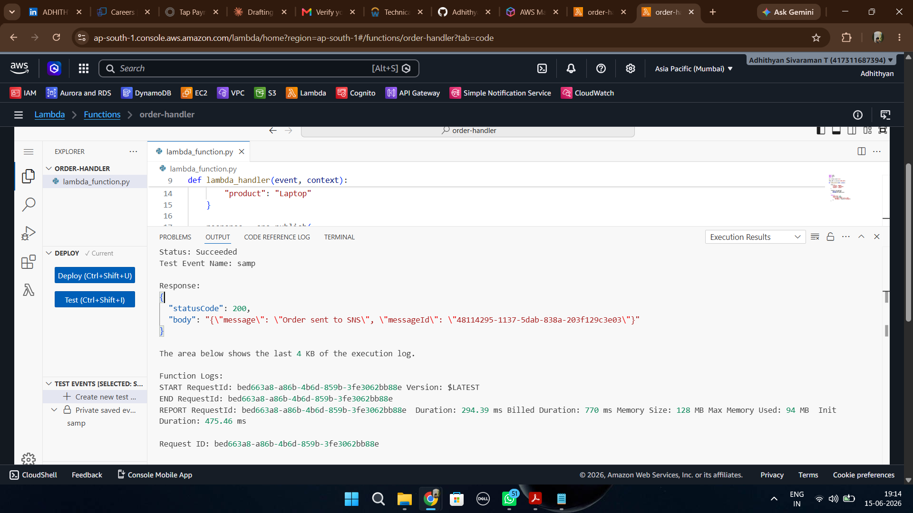

### Validation

- Lambda executed successfully
- Status Code 200 returned
- SNS publish operation completed
- Message ID generated successfully

### Outcome

The Order Service successfully publishes order events into the event-driven workflow.

---

# Step 2 — API Gateway Order Submission

The API endpoint was tested using Postman.

### Screenshot

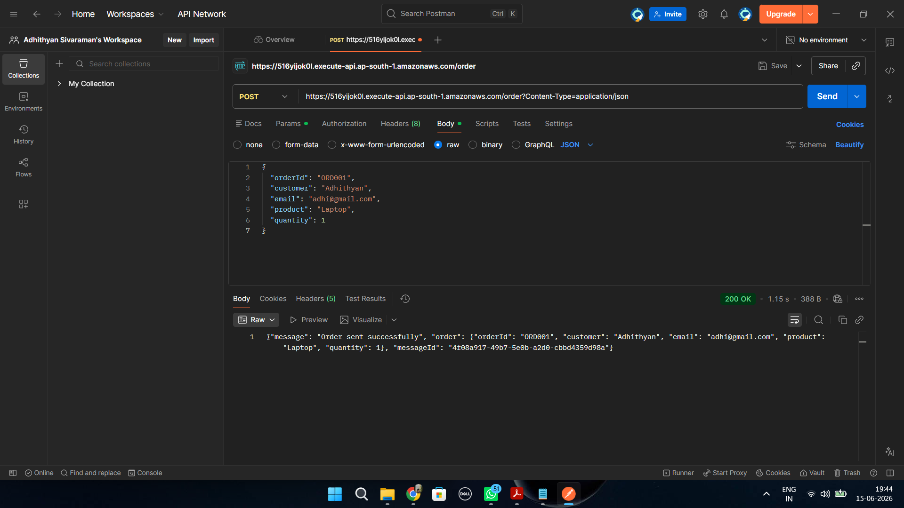

### Validation

- POST request sent successfully
- Order payload received
- API Gateway invoked Lambda
- Order response returned successfully

### Outcome

External clients can submit orders through API Gateway.

---

# Step 3 — SNS Fan-Out Verification

After an order is submitted, SNS distributes the message to subscribed SQS queues.

### Screenshot

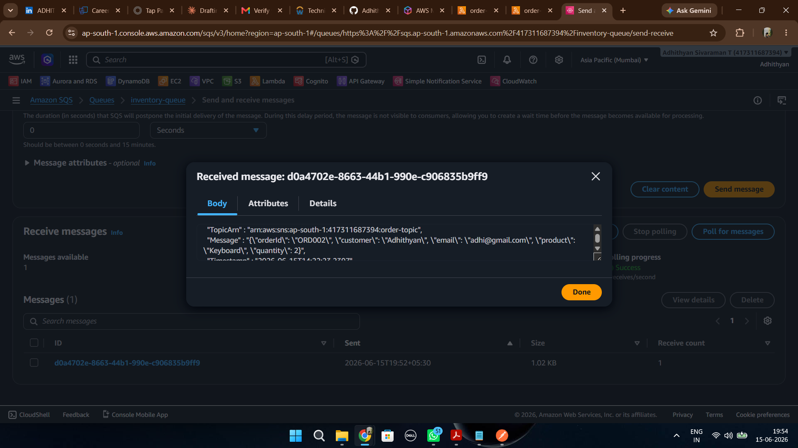

### Validation

- Order message received
- SNS metadata attached
- Message successfully delivered to SQS

### Outcome

SNS fan-out architecture is functioning correctly.

---

# Step 4 — Inventory Service Processing

The Inventory Service consumes messages from Inventory Queue.

### Screenshot

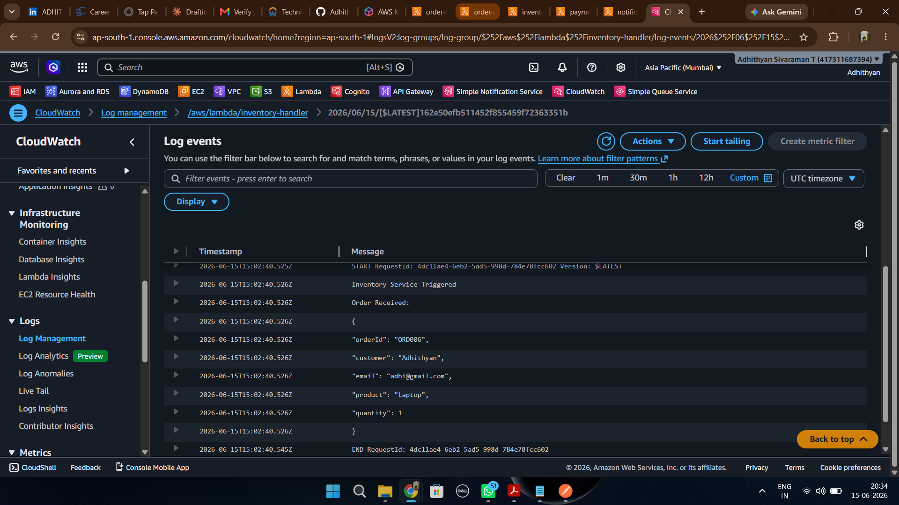

### Validation

- Lambda triggered automatically
- Order details received
- Inventory processing initiated

### Outcome

Inventory updates are executed asynchronously.

---

# Step 5 — Notification Service Processing

The Notification Service consumes messages from Notification Queue.

### Screenshot

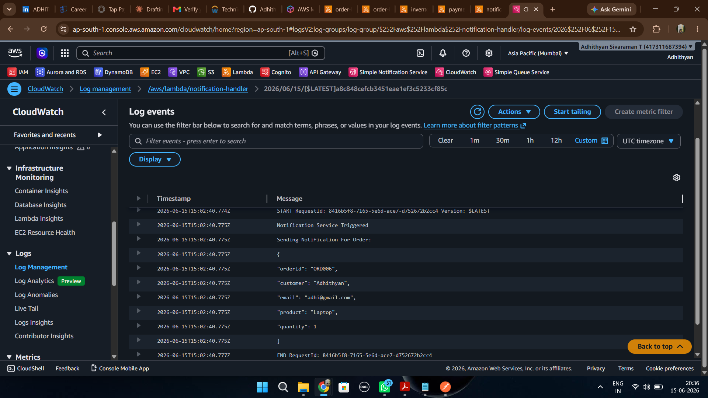

### Validation

- Notification Lambda triggered
- Order information processed
- Notification workflow executed

### Outcome

Notification events are processed independently.

---

# Step 6 — Payment Service Processing

The Payment Service consumes messages from Payment Queue.

### Screenshot

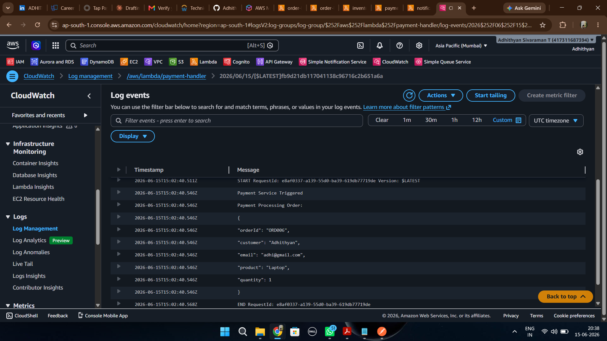

### Validation

- Payment Lambda triggered
- Order data received
- Payment processing executed

### Outcome

Payment workflow operates independently from other services.

---

# Step 7 — Idempotency Validation

Idempotency prevents duplicate order processing.

### Screenshot

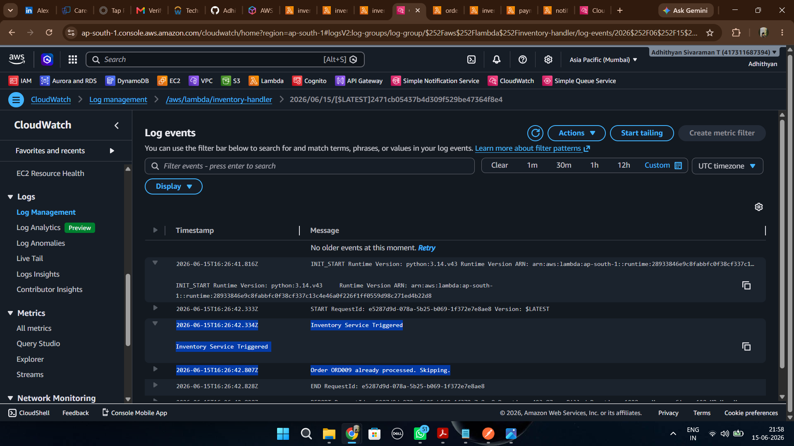

### Validation

- Duplicate order detected
- Existing order identified
- Processing skipped

### Outcome

Duplicate inventory reduction is prevented.

---

# Step 8 — Static Website Files Stored in S3

Frontend files are hosted inside Amazon S3.

### Screenshot

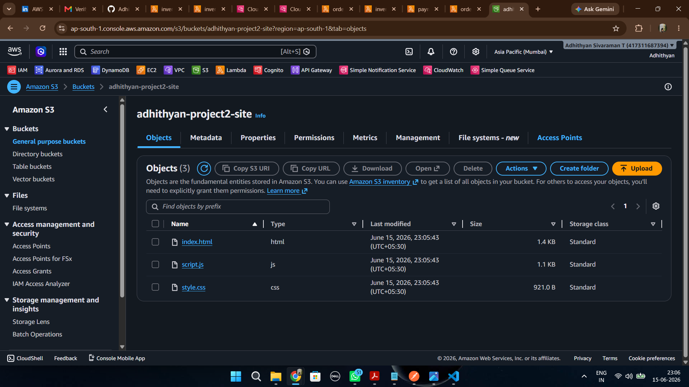

### Validation

Files uploaded:

- index.html
- script.js
- style.css

### Outcome

Frontend assets are successfully stored in S3.

---

# Step 9 — CloudMart Frontend Testing

CloudFront serves the frontend globally.

### Screenshot

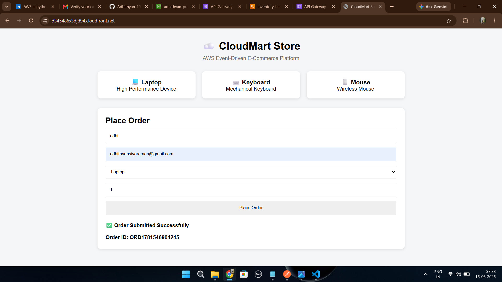

### Validation

- Website accessible
- Form submission successful
- Order ID generated
- Success message displayed

### Outcome

Frontend-to-backend integration validated successfully.

---

# Step 10 — Orders DynamoDB Table

Orders are stored in DynamoDB.

### Screenshot

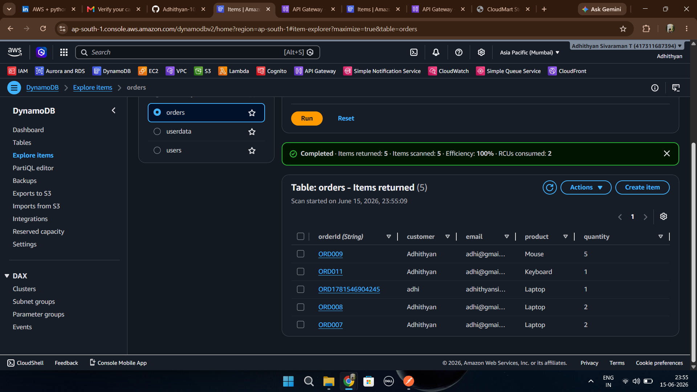

### Validation

Stored attributes include:

- orderId
- customer
- email
- product
- quantity

### Outcome

Order persistence layer is functioning correctly.

---

# Step 11 — Inventory DynamoDB Table

Inventory stock is maintained inside DynamoDB.

### Screenshot

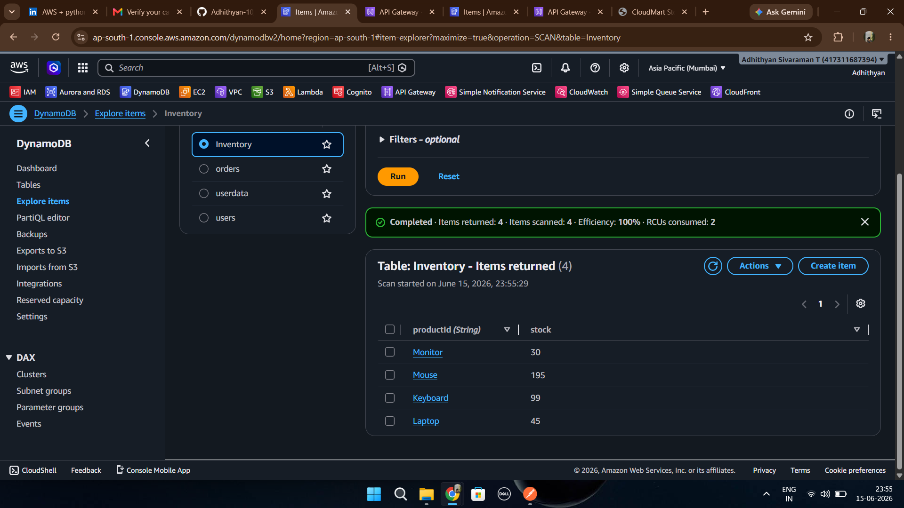

### Validation

Available products:

- Laptop
- Keyboard
- Mouse
- Monitor

### Outcome

Inventory tracking is operational.

---

# Step 12 — SNS Topic Configuration

Amazon SNS acts as the event distribution layer.

### Screenshot

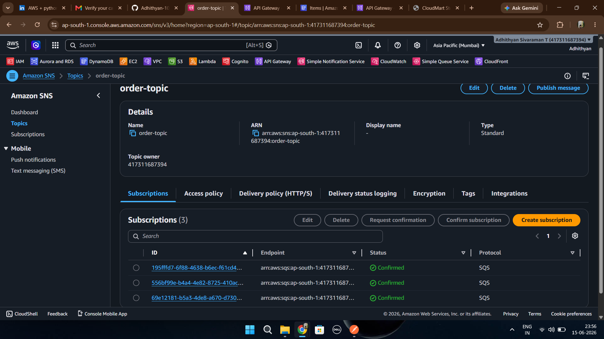

### Validation

Topic Created:

```text
order-topic
```

### Outcome

Central event distribution service established.

---

# Step 13 — SNS Subscription Configuration

SNS subscriptions connect the topic to SQS queues.

### Screenshot

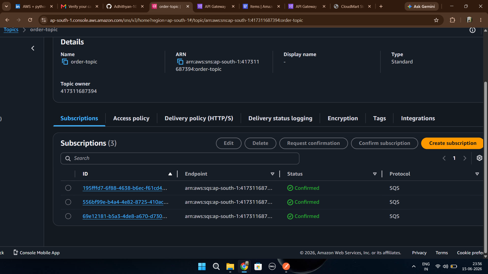

### Validation

Connected Queues:

- Inventory Queue
- Payment Queue
- Notification Queue

### Outcome

Fan-out messaging architecture configured successfully.

---

# Step 14 — SQS Queue Overview

Multiple queues support asynchronous processing.

### Screenshot

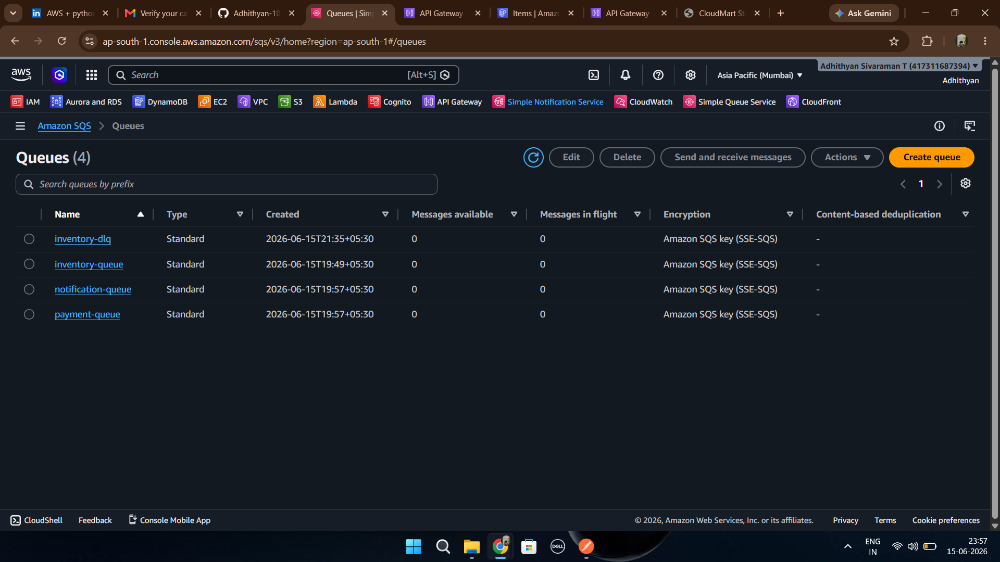

### Queues

- inventory-queue
- payment-queue
- notification-queue
- inventory-dlq

### Outcome

Microservice communication layer implemented.

---

# Step 15 — Dead Letter Queue Configuration

Inventory Queue is protected using a Dead Letter Queue.

### Screenshot

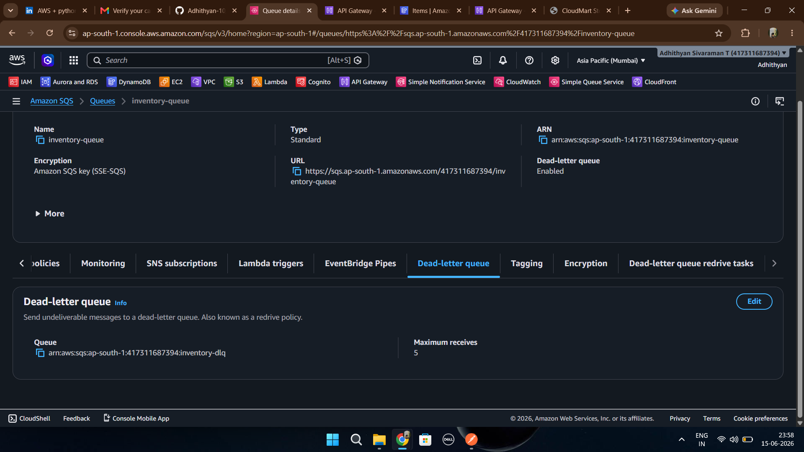

### Validation

- DLQ enabled
- Maximum Receives = 5

### Outcome

Failed messages can be isolated and analyzed safely.

---

# Step 16 — Lambda Functions Overview

The platform uses multiple Lambda functions.

### Screenshot

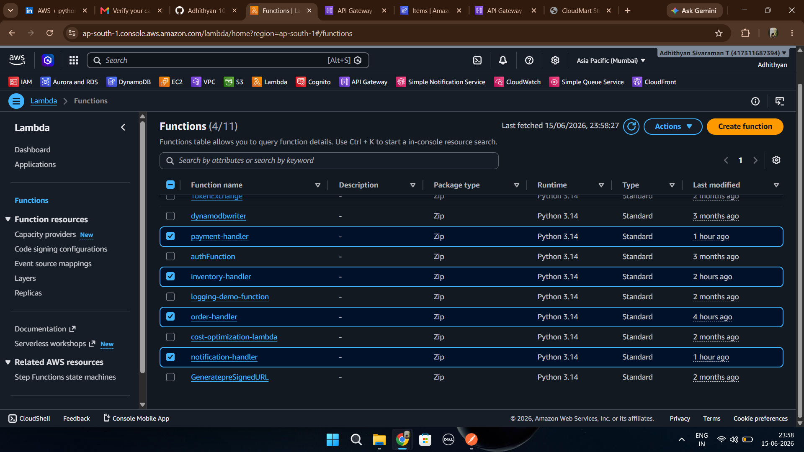

### Functions

- order-handler
- inventory-handler
- payment-handler
- notification-handler

### Outcome

Microservice architecture implemented using serverless compute.

---

# Step 17 — API Gateway Route Configuration

API Gateway exposes backend functionality.

### Screenshot

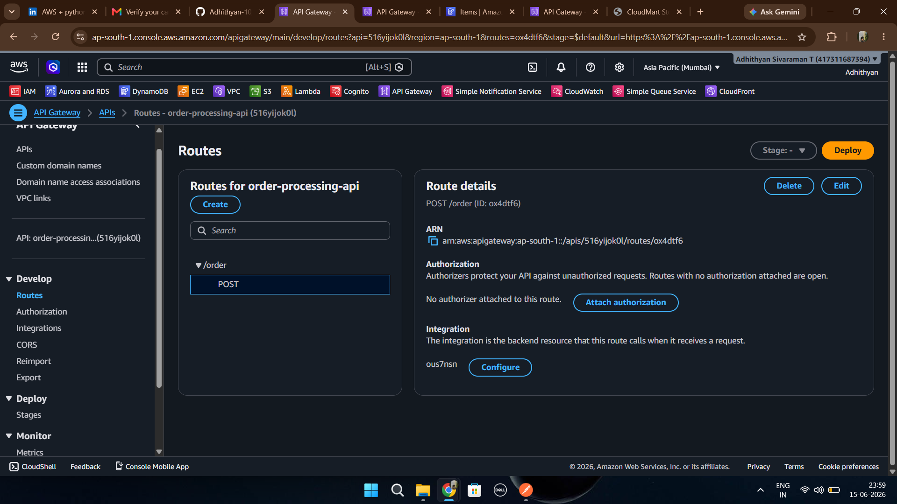

### Route

```text
POST /order
```

### Outcome

External clients can securely access backend services.

---

# Step 18 — CloudFront Distribution

CloudFront distributes frontend content globally.

### Screenshot

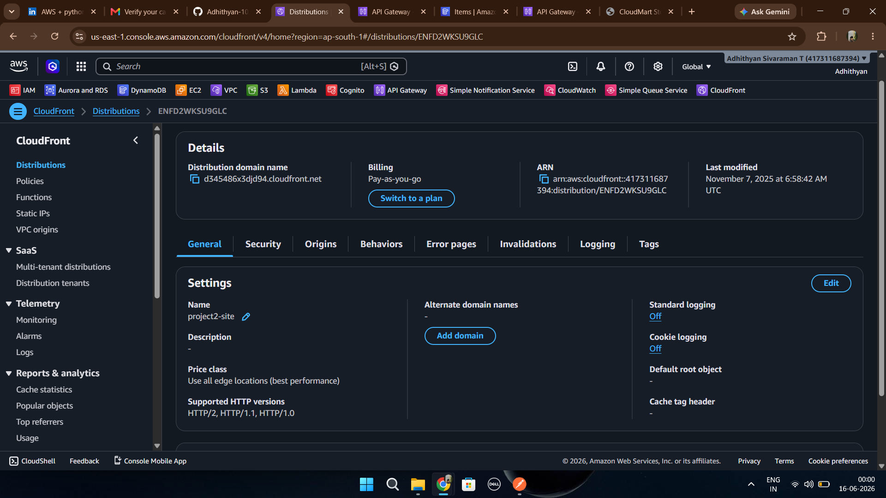

### Validation

- Distribution deployed
- Global caching enabled
- HTTPS delivery supported

### Outcome

Low-latency frontend delivery achieved.

---

# 🎯 Final Validation

The CloudMart Event-Driven E-Commerce Platform successfully demonstrates:

✅ API Gateway Integration

✅ AWS Lambda Serverless Compute

✅ SNS Fan-Out Messaging

✅ SQS Queue-Based Decoupling

✅ DynamoDB Data Persistence

✅ CloudWatch Monitoring

✅ Dead Letter Queue Handling

✅ Idempotency Implementation

✅ S3 Static Website Hosting

✅ CloudFront Global Content Delivery

---

# 🏆 End-to-End Workflow Achieved

```text
Customer
    ↓
CloudFront
    ↓
S3 Frontend
    ↓
API Gateway
    ↓
Order Lambda
    ↓
SNS Topic
    ↓
Inventory Queue
Payment Queue
Notification Queue
    ↓
Inventory Lambda
Payment Lambda
Notification Lambda
    ↓
DynamoDB
    ↓
CloudWatch
```

This walkthrough validates the successful implementation of a production-style event-driven serverless architecture on AWS.
